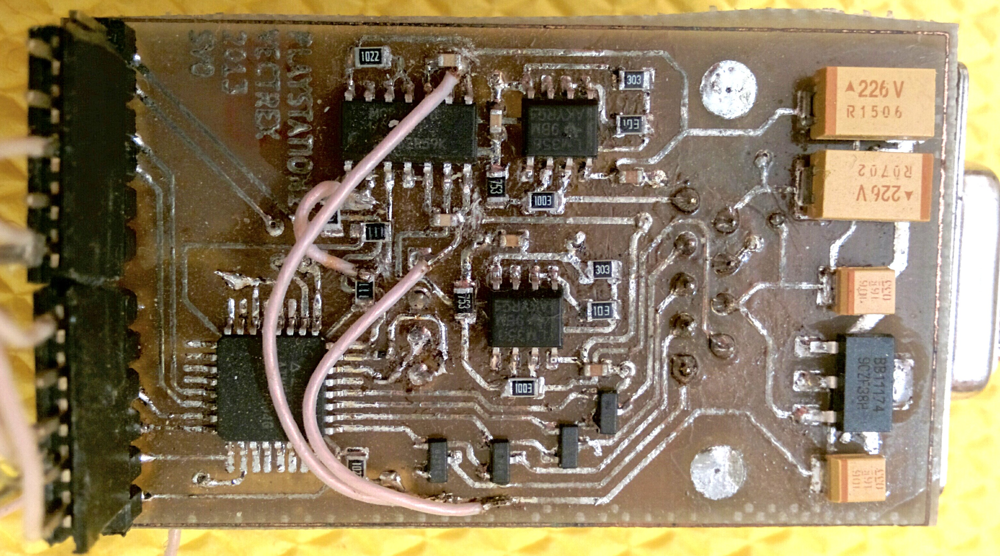

# psx2vectrex

This project allows using a classic PlayStation controller with Vectrex. 

Parts list:
 * 1x ATmega8
 * 1x MCP42010 dual-channel digital potentiometer
 * 2x LM358 opamp
 * 4x IRLML2502 (or any similar) logic-level n-channel MOSFETs
 * 1x LM1117-3V3 LDO, or equivalent
 * Some resistors and capacitors
 
Circuit in [PDF file](/kicad/vectrexmando.pdf)

The hardware is done in KiCAD. The design files are in [kicad](/kicad) directory.

To compile the source code WinAVR or avr-gcc/avr-libc is required. A programmer of choice is required to
bootstrap the microcontroller.

This adapter works excellent for me, but it's probably an overkill of a circuit for something as simple as this.

Here's a test video:

---

2013-2015 Viacheslav Slavinsky, http://sensi.org/~svo
